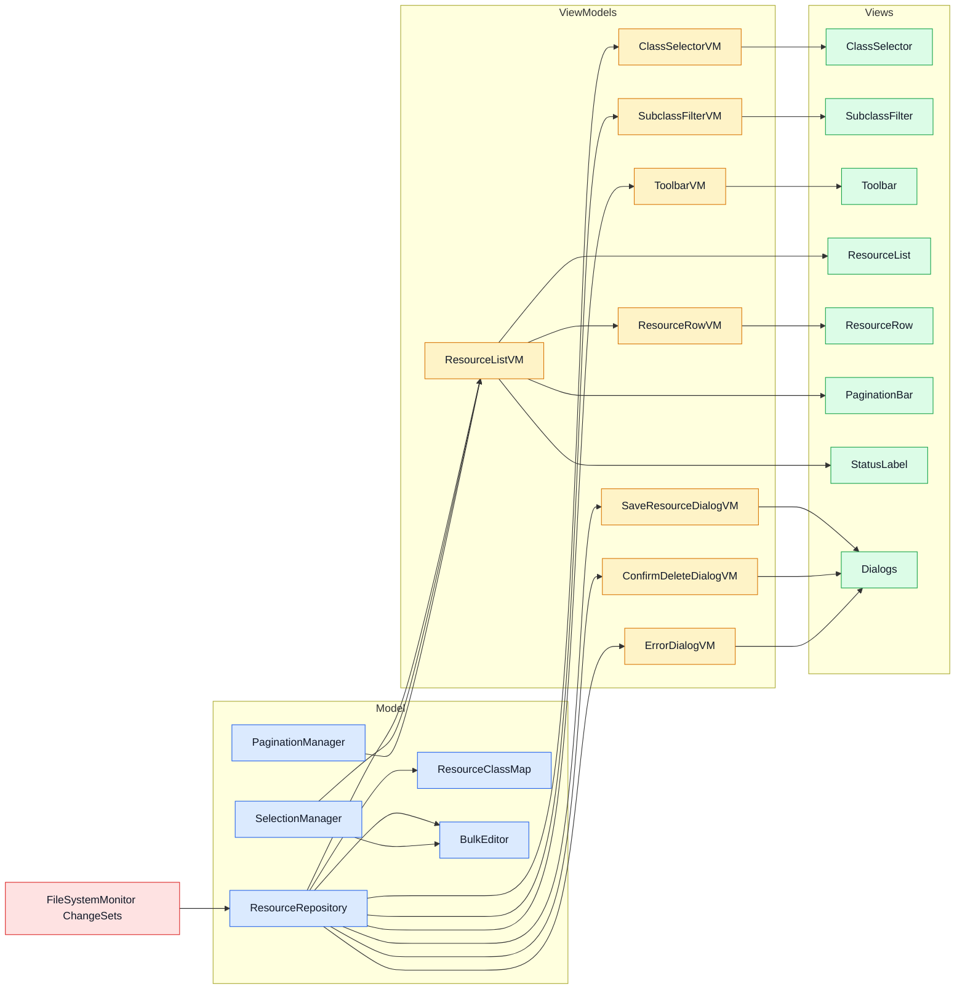

# Visual Resources Editor — Architecture

A Godot 4 `@tool` editor plugin for visually browsing, creating, bulk-editing, and deleting `.tres` resource files filtered by class type.

---

## Architecture Overview

The plugin follows an **MVVM (Model-View-ViewModel)** architecture. Views bind to
ViewModels; ViewModels read from and write to the Model layer, whose hub is
`DH_VRE_ResourceRepository`. There is no extra facade between ViewModels and the
repository.

```text
visual_resources_editor/
├── plugin.cfg
├── visual_resources_editor_plugin.gd      # EditorPlugin entry point (peer-dep check + toolbar menu)
├── visual_resources_editor_toolbar.gd     # PopupMenu: instantiates/focuses the editor window
├── visual_resources_editor_window.gd/.tscn # Composition root: creates the repository and all VMs
├── model/                                  # Model layer
│   ├── resource_repository.gd             # Hub: selected class state, CRUD, live refresh from ChangeSets
│   ├── resource_class_map.gd              # Class name ↔ script path ↔ parent maps; property extraction
│   ├── project_class_scanner.gd           # Static utility: scans .tres files by script_class
│   ├── resource_sorter.gd                 # Static utility: type-aware column sorting
│   ├── selection_manager.gd               # Multi-select logic (single / ctrl / shift + anchor)
│   ├── pagination_manager.gd              # Page arithmetic and page-slice extraction (50/page)
│   ├── column_widths_store.gd             # Per-class column widths in editor project metadata
│   ├── bulk_editor.gd                     # Node: inspector proxy + debounced bulk write-back
│   └── resource_property.gd               # Typed data model for a single property definition
├── viewmodel/                              # ViewModel layer (all RefCounted)
│   ├── class_selector_vm.gd
│   ├── subclass_filter_vm.gd
│   ├── toolbar_vm.gd
│   ├── resource_list_vm.gd                # Composes SelectionManager + PaginationManager + sorter
│   ├── resource_row_vm.gd                 # Per-row VM; selection state pushed in by the list VM
│   ├── save_resource_dialog_vm.gd
│   ├── confirm_delete_dialog_vm.gd
│   └── error_dialog_vm.gd
├── view/                                   # View layer (@tool scenes/scripts)
│   ├── class_selector/class_selector.gd/.tscn
│   ├── subclass_filter/subclass_filter.gd/.tscn
│   ├── toolbar/toolbar.gd/.tscn
│   ├── resource_list/
│   │   ├── resource_list.gd/.tscn         # Table container; hosts %BulkEditor and %Toolbar
│   │   ├── header_row.gd/.tscn            # Column headers with sort indicators + resize grips
│   │   ├── resource_row.gd/.tscn          # One row per resource (binds to a ResourceRowVM)
│   │   ├── resource_field_label.gd/.tscn  # One property cell
│   │   ├── column_grip.gd/.tscn           # Draggable header separator: emits resize drags
│   │   ├── header_field_label.tscn
│   │   └── field_separator.tscn
│   ├── pagination_bar/pagination_bar.gd/.tscn
│   ├── status_label.gd                    # Script-only Label: resource count / selection count
│   └── dialogs/
│       ├── dialogs.gd/.tscn               # Container: forwards VMs into the three dialogs
│       ├── save_resource_dialog.gd        # EditorFileDialog (script-only node)
│       ├── confirm_delete_dialog.gd       # ConfirmationDialog (script-only node)
│       └── error_dialog.gd                # AcceptDialog (script-only node)
└── docs/
```

## Peer Dependency: FileSystemMonitor

Live refresh consumes `DH_FSM_ChangeSet`s from the **FileSystemMonitor** addon
(`DH_FileSystemMonitorPlugin.instance`). `resource_repository.gd` references its
classes at parse time, so the plugin only compiles when the monitor is installed.
`visual_resources_editor_plugin.gd` checks the global class list on enable and
`push_error`s with the repo URL if it is missing.

## Model Layer

- **`DH_VRE_ResourceRepository`** is the hub. It owns `selected_class` and
  `include_subclasses` (setters trigger `_reload()`), holds
  `current_class_resources`, and exposes CRUD:
  - `create(script, path)` — `script.new()` + `ResourceSaver.save()`
  - `request_delete(paths)` → `confirmation_needed` → `delete(paths)` (OS trash)
  - `save_one(path, resource)` / `save_multi(entries)` — all disk writes go
    through the repository, which emits `resources_saved` / `error_occurred`.
  - **Live refresh**: subscribes to the monitor's `changes_detected` and maps
    created/modified/deleted/moved files onto add/remove/modify deltas
    (`resources_changed`) — no rescan, no mtime cache. On
    `script_classes_updated` it rebuilds the class map, follows class renames
    by script path, clears the selection when the class is deleted, and resaves
    resources whose class was removed (orphan cleanup).
- **`DH_VRE_ResourceClassMap`** builds name→path and name→parent maps from
  `ProjectSettings.get_global_class_list()` (Resource descendants outside
  `addons/` only) and extracts editor-visible `DH_VRE_ResourceProperty` lists
  from scripts.
- **`DH_VRE_ProjectClassScanner`** (static) walks `EditorFileSystemDirectory`
  and matches `.tres` files by the `script_class` header, skipping
  `res://addons/`.
- **`DH_VRE_ResourceSorter`** (static) sorts by column with type-aware
  comparison; nulls sort last, resource path is the tiebreak.
- **`DH_VRE_BulkEditor`** (Node inside `resource_list.tscn`) drives Godot's
  `EditorInspector`: it builds a proxy Resource from the selection's common
  script, shows it via `EditorInterface.inspect_object()`, and on
  `property_edited` copies the value to every selected resource. Writes are
  debounced through `%SaveDebounceTimer` and flushed via
  `resource_repo.save_multi()`. It connects directly to the repository and
  selection manager — it has no View, so it has no ViewModel.

## ViewModel Layer

All VMs are `RefCounted` and depend only on the repository (and what it
exposes). `DH_VRE_ResourceListVM` is the largest: it composes a
`SelectionManager` and `PaginationManager`, applies the sorter, reconciles
selection on data changes, and emits UI-shaped signals (`rows_replaced`,
`columns_changed`, `sort_state_changed`, `pagination_state_changed`,
`status_text_changed`). It creates one `DH_VRE_ResourceRowVM` per visible row
and **pushes** selection state into rows (`set_selected_state`) — rows do not
subscribe to global selection.

Two intentional deviations from "the window creates every VM":

- `DH_VRE_ToolbarVM` is created by `ResourceList._connect_vm()`, because it
  needs the list VM's `SelectionManager`.
- `DH_VRE_SaveResourceDialogVM` takes that `toolbar_vm` to react to
  `create_requested`.

## View Layer

Views are `@tool` scripts using `%UniqueNode` references. Each has a typed `vm`
property with the setter + `is_node_ready()` guard pattern, so wiring works
regardless of ready order. `DH_VRE_Window` is the composition root:

```gdscript
func _ready() -> void:
	_resource_repo = DH_VRE_ResourceRepository.new()

	%ClassSelector.vm = DH_VRE_ClassSelectorVM.new(_resource_repo)
	%SubclassFilter.vm = DH_VRE_SubclassFilterVM.new(_resource_repo)
	%ResourceList.vm = DH_VRE_ResourceListVM.new(_resource_repo)

	%Dialogs.save_dialog_vm = DH_VRE_SaveResourceDialogVM.new(_resource_repo, %ResourceList.toolbar_vm)
	%Dialogs.confirm_delete_vm = DH_VRE_ConfirmDeleteDialogVM.new(_resource_repo)
	%Dialogs.error_dialog_vm = DH_VRE_ErrorDialogVM.new(_resource_repo)

	_resource_repo.start()
```

`start()` connects the repository to the monitor; `stop()` (on window close)
disconnects it.

## Signal Flow

```text
Monitor ChangeSet
  → ResourceRepository filters to watched classes, applies deltas
  → resources_changed / resources_reseted
  → ResourceListVM: sort → reconcile selection → re-page
  → rows_replaced → ResourceList rebuilds row scenes

Row click → RowVM.select() → ListVM.handle_row_click() → SelectionManager
  → selection_changed → ListVM pushes is_selected into RowVMs
  → BulkEditor rebuilds the inspector proxy

Inspector edit → BulkEditor applies to selected resources (debounced)
  → repository.save_multi() → resources_saved → row display refresh
```



## Design Decisions

### Repository as the Model hub (no facade)
Earlier iterations had a `VREStateManager` proxy and a `VREModel` facade; both
were removed. ViewModels talk to `DH_VRE_ResourceRepository` directly, which
keeps the call stack at View → VM → Repository → helper.

### Incremental refresh over rescanning
The repository consumes already-computed ChangeSets from FileSystemMonitor
instead of maintaining its own mtime cache and rescanning `res://`. Full scans
only happen on class/filter change.

### BulkEditor connects directly to the Model
It is a non-visual service; a `BulkEditVM` wrapper would be pure passthrough.

### Per-row ViewModels with pushed selection
`ResourceListVM` emits `Array[ResourceRowVM]` and pushes `is_selected` state
into the affected rows. Rows never subscribe to global signals, so replaced
rows cannot leak connections.

### Debounced saves
`property_edited` fires per keystroke; `BulkEditor` batches writes behind
`%SaveDebounceTimer` and flushes on pause, selection change, or window close.

### Scene Unique Nodes (`%NodeName`)
All child node references use `%UniqueNode` directly in code per CLAUDE.md.

### Delete moves to OS trash
`ResourceRepository.delete()` uses `OS.move_to_trash()`. No undo/redo —
version control is the recovery path.
